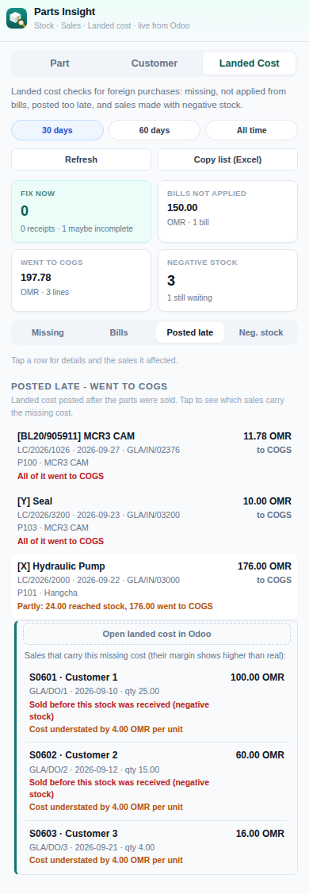
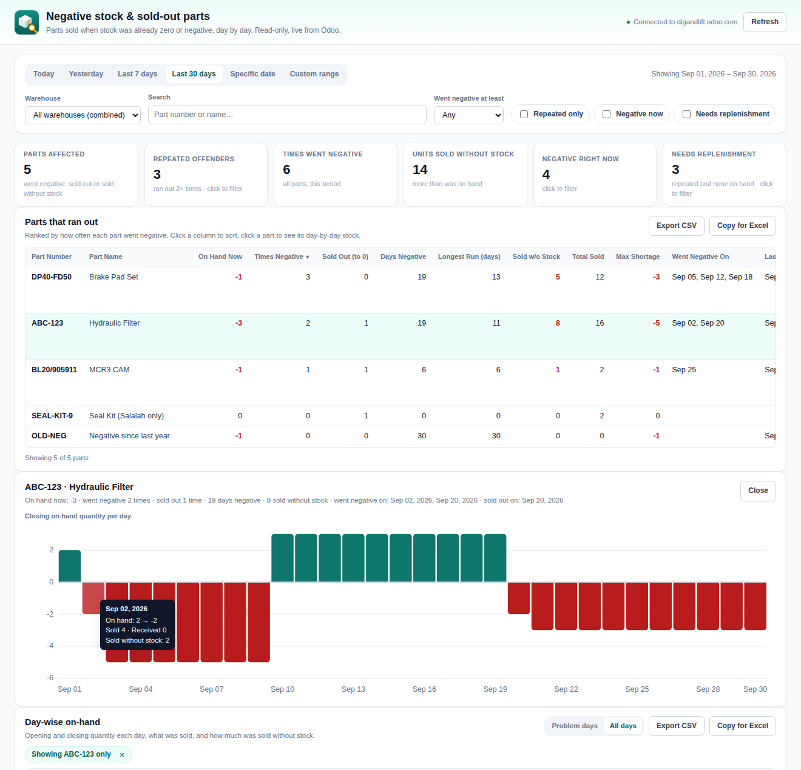

<p align="center">
  
</p>

<h1 align="center">Parts Insight for Odoo</h1>

<p align="center">
  A Chrome extension for looking up spare parts, customers, landed costs and stock-outs, live from your Odoo 17 session.<br>
  <b>Read-only:</b> it never creates, edits or deletes anything in Odoo.
</p>

---

## What it does

The extension opens as a popup or side panel next to your Odoo tab and has four modes. The Stock-outs mode also opens a full-page report.

### Part
Search by part number or name, then switch between three tabs:

| Tab | Shows |
|---|---|
| **Stock & Location** | On hand and reserved quantity per location, which transfers hold the reserved stock, incoming purchase orders, and stock value |
| **Cost** | Current average cost, vendor comparison, and full purchase history, with prices converted to OMR, local vs foreign purchases, and the landed cost per shipment. It flags landed costs that never reached the product cost. |
| **Sales History** | Top customers, transactions by month, delivery and invoice status, approximate margin, and list price drift. It warns on sales made before a late landed cost was posted. |

A **Copy part summary** button copies everything as plain text.

### Customer
Search customers by name, or with filters such as `Muscat over OMR 5000`. Quick filters are *Dormant 90+ days*, *Open quotes*, *Muscat* and *Salalah*. Each customer shows orders, buying pattern, open quotations and top purchased parts, with copy buttons for a summary or an order list.

### Landed Cost
A company-wide check for landed cost problems. You can look at the last **30 days**, **60 days** or **all time**.

| Tab | List | Why it matters |
|---|---|---|
| **Missing** | Foreign receipts with **no landed cost, still in stock** | Fix these first. Posting the landed cost now still reaches the product cost. |
| | Foreign receipts with **no landed cost, already sold** | When the bill arrives, the cost goes straight to COGS. |
| | Receipts that **have a landed cost but may be missing one**, for example transport posted but no LC charges | Based on the charges each vendor's shipments normally carry, learned from the last 365 days. |
| **Bills** | Posted vendor bills with landed-cost lines that were **not applied**, or only partly | Covers all vendors, including local freight forwarders and clearing agents. |
| **Posted late** | Landed costs whose share **went to COGS** because the parts were already sold | Tap a row to see **which sales** used those units and how much of the cost belongs to each one. |
| **Neg. stock** | Sales **delivered before the stock was received**, either still waiting or already covered | Landed costs for these units always go to COGS, so the sale margin is overstated. |

Tap any row to see details and buttons that open the receipt, bill, landed cost or sale order in Odoo. **Copy list (Excel)** copies every list as tab-separated text.

<p align="center"></p>

### Stock-outs
Shows which parts are **regularly sold when stock is already zero or negative**. The popup shows the parts that run out most often in the last 7 or 30 days. **Open full report** (or tap a part) opens a full-page report in a new tab:

- **Filters:** Today, Yesterday, Last 7 days, Last 30 days, a specific date, or a custom date range. Warehouse (all combined, or one warehouse). Search by part number or name. "Went negative at least N times", *Repeated only*, *Negative now* and *Needs replenishment*.
- **Summary tiles:** parts affected, repeated offenders, times stock went negative, units sold without stock, parts negative right now, and parts needing replenishment. Tiles marked "click to filter" apply that filter.
- **Parts that ran out:** one row per part with part number and name, on hand now, **times it went negative**, times it sold out (a sale took it to exactly 0), days negative, longest negative run, **units sold without stock**, total sold, maximum shortage, **the dates it went negative**, and the last negative day. Parts are ranked by how often they went negative, and every column can be sorted.
- **Click a part** to see a chart of its closing on-hand quantity per day (hover a bar for that day's details), and the day-wise table filtered to that part.
- **Day-wise on-hand:** date, part number and name, on hand at the start of the day, received, sold, customer returns, other movements out, on hand at the end of the day, negative quantity, and units sold without stock. You can show *problem days* only or *all days*.
- **Export:** each table can be downloaded as CSV or copied for Excel, using the current filters and sorting.

**Flags:** *Repeated* means the part went negative or sold out 2+ times in the period. *Needs replenishment* means it is repeated and has nothing on hand now. *Negative now* means today's on-hand quantity is below zero.

**How the numbers are worked out:** Odoo doesn't keep stock levels per day. The report starts from today's actual on-hand quantity and walks back through every completed stock move, so it knows the balance before and after each move. From that:
- **On hand (end of day)** is exact for every day.
- **Sold without stock** is the part of each sale that was more than the quantity on hand at that moment. For example, 4 sold with 2 on hand counts as 2.
- **Went negative** counts each time the balance crossed from zero or above to below zero, even if it recovered the same day.
- Moves between locations of the same warehouse don't count. With a single warehouse selected, transfers to and from other warehouses do count.
- Days follow your computer's time zone.

<p align="center"></p>

---

## Why landed costs go missing

In Odoo (AVCO or FIFO), a landed cost only raises the product cost for the quantity **still in stock** on that receipt. Any share for units already sold goes **straight to COGS**. It doesn't appear in Stock Valuation and never reaches the sale's margin.

So when parts sell before their transport or clearing bill is posted, or are sold with negative stock:

- the **P&L total is correct**, because the cost is in COGS;
- the **sale margin is overstated** and the **product cost field is too low**.

The Landed Cost mode finds these cases so they can be fixed before the parts sell, or at least measured.

---

## Installation

1. Download or clone this repository.
2. In Chrome, open `chrome://extensions` and turn on **Developer mode**.
3. Click **Load unpacked** and select this folder.
4. Open or reload your Odoo tab, then click the extension icon. You can also pin it or open it in the side panel.

**To update:** pull the latest version, click **Reload** on the extension card, and reload the Odoo tab.

### Using a different Odoo address
The extension only runs on `https://digandlift.odoo.com`. For another database, change both `content_scripts.matches` and `host_permissions` in `manifest.json`.

---

## Security and privacy

- **Read-only by design.** Every request goes through one function (`callKw` in `content-scripts/odoo-bridge.js`), which only ever calls `search_read`.
- **Uses your existing Odoo login.** There are no passwords, API keys or separate accounts. Each user only sees what their own Odoo access rights allow.
- **No external servers.** Data goes only between your browser and your Odoo, and nothing is stored.
- Clicking **Open in Odoo** only opens the normal Odoo page in a new tab. Any change made on that page is a normal Odoo action by that user.

---

## Good to know (limitations)

- **Foreign vs local** is based on the vendor's country, falling back to the purchase currency. Make sure every vendor has a country set.
- A receipt counts as having a landed cost once **any** landed cost is posted on it. The "may be missing one" list is a strong hint, not proof.
- The **Bills** tab relies on transport, customs and LC charge products being set as **Is a Landed Cost** in Odoo.
- **Which sales were affected** is worked out by replaying the product's stock history oldest-first, because Odoo doesn't store which sale used which receipt. When the result doesn't exactly match Odoo's own figures (for example after returns), the list is marked **Approximate**.
- Covered negative-stock sales only show when Odoo made a cost correction for them, meaning the receipt price was different from the cost the sale used.
- **All time** can take several seconds on a large database.
- **Stock-outs** covers storable products only, since services and consumables have no on-hand quantity. A long custom range reads every stock move since its start date, so it can take a while on a busy database.
- With **all warehouses combined**, a part that is negative in one warehouse but covered by another won't show. Pick a single warehouse to see it.

---

## Project structure

```
manifest.json                 Chrome extension manifest (MV3)
content-scripts/
  odoo-bridge.js              Runs on the Odoo tab: all read-only Odoo queries
lib/                          Pure logic, no Odoo or DOM access, unit tested
  part-data.js                Part mode: stock, cost, sales calculations
  customer-data.js            Customer mode: cards, buying pattern, exports
  filters.js                  Customer search text parsing and filtering
  landed-audit.js             Landed Cost mode: all checks, FIFO replay, Excel export
  stockout-analysis.js        Stock-outs: day-by-day balances, events, filters, CSV
popup/                        The popup / side panel
  popup.html, popup.css
  core.js                     Shared: Odoo tab connection, screens, row/list helpers
  modes/                      One file per mode: part, customer, landed, stockouts
  main.js                     Mode toggle, tab tracking, startup
report/
  stockouts.html / .css / .js Full-page Stock-outs report (opens in a new tab)
styles/tokens.css             Colours, spacing and shadows shared by popup and report
icons/                        Extension icons (16, 32, 48, 128 px)
tests/                        Unit tests for lib/ (plain Node, no dependencies)
docs/                         Images used in this README
```

**How it fits together:** each screen (a popup mode or the report page) sends a message such as `GET_STOCKOUT_DATA` to `odoo-bridge.js` on the Odoo tab. The bridge queries Odoo with the user's session and returns raw records. The functions in `lib/` then turn them into what the screen shows. Screens contain no calculations, and `lib/` contains no Odoo or screen code.

---

## Development

Requires Node.js 18+ for the tests only. The extension itself has no build step and no dependencies.

```bash
npm test          # runs every test in tests/
```

After changing any file, click **Reload** on `chrome://extensions` and reload the Odoo tab.
